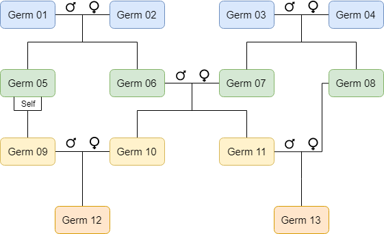

Pedigree Tree
=============

Definitions
-----------

Pedigree Tree
  The full network graph of related germplasm, accessions, lines, crosses, etc.
  
Pedigree Node 
  A single germplasm in the Pedigree Tree structure. Each Node is connected to other nodes with a Parent, Progeny, or Sibling 
  relationship. These relationships form the edges of the Tree structure.
  
Parent Relationship 
  The uni-directional relationship indicating that germplasm A is a parent of germplasm B. This is the inverse of a Progeny 
  Relationship.
  
Progeny Relationship 
  The uni-directional relationship indicating that germplasm B is a child of germplasm A. This is the inverse of a Parent Relationship.
  
Sibling Relationship
  The bi-directional relationship indicating that germplasm C and germplasm D share at least one Parent. 

Implementation Notes
--------------------

The BrAPI pedigree endpoints allow a client application to view, upload, and edit a pedigree tree on a remote server. Each Tree is 
defined as a collection of Nodes, with each Node having a one-to-one relationship with a Germplasm and/or Cross entity. Each Node
object has a list of Parents, a list of Progeny, and a list of Siblings. All three of these are lists contain relationships from 
the given Node to other Nodes, and each relationship forms an edge of the tree structure. Every pedigree endpoint will respond with 
an array of Pedigree Nodes. This array is a flat, one dimensional, data structure, but it should contain enough information (node 
definitions and edge definitions) to reconstruct a full tree data structure.

The endpoints ``POST /pedigree`` (upload) and ``PUT /pedigree`` (edit) are relatively easy to implement. ``POST /pedigree`` allows 
a client application to upload an array of pedigree nodes. It is then up to the server to determine if these new nodes connect 
with any existing structures, and generate new relationships as needed. The server may also have quality filters in place to only 
allow certain types of relationships (ie a germplasm can not be its own grandparent) and the server may respond in error if these 
rules are violated. Similarly, ``PUT /pedigree`` allows a client application to edit existing nodes, referencing each node by 
``germplasmDbId``. Edits may include changes to the relationships and the structure of the tree, and again it is the servers
responsibility to generate new relationships as needed and reject submissions that violate any custom filters.

The endpoints ``GET /pedigree`` and ``POST /search/pedigree`` allow a client application to retrieve nodes of an existing pedigree 
tree. These endpoints can be more complicated to implement because they provide search parameters and controls to retrieve any 
slice or subset of nodes from the full tree structure. These endpoints are intended to provide power and flexibility to the 
retrieval of pedigree data, while maintaining a level of simplicity and intuitiveness for the developer. 

The endpoints ``GET /pedigree`` and ``POST /search/pedigree`` have three groups of parameters; search parameters, array control 
parameters, and recursion control parameters. Most of the parameters for these endpoints are search parameters, including things like 
``germplasmDbId``, ``familyCode``, ``studyDbId``, etc. These parameters exactly match the search parameters for ``GET /germplasm``
and they are intended to find one or more germplasm and return the pedigree nodes associated with those germplasm. This collection of 
germplasm will form the base of the pedigree tree. There are three recursion control parameters: ``pedigreeDepth``, ``progenyDepth``, 
and ``includeFullTree``. These parameters control the recursive process of collecting additional nodes to be returned to the client.
Starting from germplasm found by the basic search at the base of the tree, ``pedigreeDepth`` tells the server how many generations 
of parents to collect and return. Similarly ``progenyDepth`` tells how many generations of children to return. The ``includeFullTree``
parameter will collect all the nodes that are direct descendants or direct ancestors with the base nodes. This effectively sets 
``pedigreeDepth`` and ``progenyDepth`` to infinity without needing to know the size of the full tree ahead of time. After the base
nodes have been found and the generation nodes have been collected recursively, the array control parameters change the structure 
of the response JSON. The parameters ``includeParents``, ``includeProgeny``, and ``includeSiblings`` control whether or not the
``parents``, ``progeny``, and ``siblings`` arrays are included, respectively, in the JSON response. These three parameters allow the 
client to hide duplicate/redundant information, or hide an array that might be too large, causing the response to be inefficient.

Implementation Examples
-----------------------

   
This is an example of a simple pedigree with 13 germplasm over 4 generations. Below are several examples of BrAPI calls using this 
example pedigree data. These examples are meant to illustrate how to implement the various endpoints, search parameters, and 
controls available for BrAPI pedigrees. 

Get Pedigree from GermplasmDbId
^^^^^^^^^^^^^^^^^^^^^^^^^^^^^^^

``GET /pedigree?germplasmDbId=germ01``

In this example, the base node ``germ01`` is found directly by its germplasmDbId. By default, ``pedigreeDepth`` and ``progenyDepth``
are both set to "1". ``germ01`` has no parent data available, but it does have two progeny ``germ05`` and ``germ06``. These two 
nodes are also returned, but no more descendants, since the recursive function only went "1" generation down the tree. 

.. code-block:: json

   [{
      "germplasmDbId": "germ01",
      "germplasmName": "Germplasm 01",
      "parents": [],
      "progeny": [
         { "germplasmDbId": "germ05", "germplasmName": "Germplasm 05", "parentType": "MALE" },
         { "germplasmDbId": "germ06", "germplasmName": "Germplasm 06", "parentType": "MALE" }
      ],
      "siblings": []
   }, {
      "germplasmDbId": "germ06",
      "germplasmName": "Germplasm 06",
      "parents": [
         { "germplasmDbId": "germ01", "germplasmName": "Germplasm 01", "parentType": "MALE" },
         { "germplasmDbId": "germ02", "germplasmName": "Germplasm 02", "parentType": "FEMALE" }
      ],
      "progeny": [
         { "germplasmDbId": "germ10", "germplasmName": "Germplasm 10", "parentType": "MALE" },
         { "germplasmDbId": "germ11", "germplasmName": "Germplasm 11", "parentType": "MALE" }
      ],
      "siblings": [
         { "germplasmDbId": "germ05", "germplasmName": "Germplasm 05" }
      ]
   }, {
      "germplasmDbId": "germ05",
      "germplasmName": "Germplasm 05",
      "parents": [
         { "germplasmDbId": "germ01", "germplasmName": "Germplasm 01", "parentType": "MALE"  },
         { "germplasmDbId": "germ02", "germplasmName": "Germplasm 02", "parentType": "FEMALE" }
      ],
      "progeny": [
         { "germplasmDbId": "germ09", "germplasmName": "Germplasm 09", "parentType": "SELF" }
      ],
      "siblings": [
         { "germplasmDbId": "germ06", "germplasmName": "Germplasm 06" }
      ]
   }]

   
Get Pedigree from Search Parameters
^^^^^^^^^^^^^^^^^^^^^^^^^^^^^^^^^^^

``GET /pedigree?studyDbId=Yield_Trial_2020&collection=Test_Panel_A``

In this example, the exact germplasmDbId is not known, so a broader search is requested for any germplasm that are associated with 
the ``study`` "Yield_Trial_2020" and the ``collection`` "Test_Panel_A". For this example we will assume that both ``germ03`` and 
``germ04`` are found with these search parameters. By default, ``pedigreeDepth`` and ``progenyDepth`` are both set to "1". Neither
``germ03`` nor ``germ04`` have parent data available, but they do have two progeny ``germ07`` and ``germ08``. These two nodes are 
also returned, but no more descendants, since the recursive function only went "1" generation down the tree. 

.. code-block:: json

   [{
      "germplasmDbId": "germ03",
      "germplasmName": "Germplasm 03",
      "parents": [],
      "progeny": [
         { "germplasmDbId": "germ07", "germplasmName": "Germplasm 07", "parentType": "MALE" },
         { "germplasmDbId": "germ08", "germplasmName": "Germplasm 08", "parentType": "MALE" }
      ],
      "siblings": []
   },{
      "germplasmDbId": "germ04",
      "germplasmName": "Germplasm 04",
      "parents": [],
      "progeny": [
         { "germplasmDbId": "germ07", "germplasmName": "Germplasm 07", "parentType": "FEMALE" },
         { "germplasmDbId": "germ08", "germplasmName": "Germplasm 08", "parentType": "FEMALE" }
      ],
      "siblings": []
   },{
      "germplasmDbId": "germ07",
      "germplasmName": "Germplasm 07",
      "parents": [
         { "germplasmDbId": "germ03", "germplasmName": "Germplasm 03", "parentType": "MALE" },
         { "germplasmDbId": "germ04", "germplasmName": "Germplasm 04", "parentType": "FEMALE" }
      ],
      "progeny": [
         { "germplasmDbId": "germ10", "germplasmName": "Germplasm 10", "parentType": "FEMALE" },
         { "germplasmDbId": "germ11", "germplasmName": "Germplasm 11", "parentType": "FEMALE" }
      ],
      "siblings": [
         { "germplasmDbId": "germ08", "germplasmName": "Germplasm 08" }
      ]
   },{
      "germplasmDbId": "germ08",
      "germplasmName": "Germplasm 08",
      "parents": [
         { "germplasmDbId": "germ03", "germplasmName": "Germplasm 03", "parentType": "MALE" },
         { "germplasmDbId": "germ04", "germplasmName": "Germplasm 04", "parentType": "FEMALE" }
      ],
      "progeny": [
         { "germplasmDbId": "germ13", "germplasmName": "Germplasm 13", "parentType": "FEMALE" }
      ],
      "siblings": [
         { "germplasmDbId": "germ07", "germplasmName": "Germplasm 07" }
      ]
   }]
   

Limit Pedigree Depth
^^^^^^^^^^^^^^^^^^^^

``GET /pedigree?germplasmDbId=germ12&pedigreeDepth=2``

In this example, the client is request "2" generations of pedigree data starting at ``germ12``. Starting at ``germ12`` as 
generation "0", the recursive algorithm collects ``germ09`` and ``germ10`` as generation "1", then it collects ``germ05``, 
``germ06``, and ``germ07`` as generation "2". 

.. code-block:: json

   [{
      "germplasmDbId": "germ12",
      "germplasmName": "Germplasm 12",
      "parents": [
         { "germplasmDbId": "germ09", "germplasmName": "Germplasm 09", "parentType": "MALE" },
         { "germplasmDbId": "germ10", "germplasmName": "Germplasm 10", "parentType": "FEMALE" }
      ],
      "progeny": [],
      "siblings": []
   },{
      "germplasmDbId": "germ09",
      "germplasmName": "Germplasm 09",
      "parents": [
         { "germplasmDbId": "germ05", "germplasmName": "Germplasm 05", "parentType": "SELF" }
      ],
      "progeny": [
         { "germplasmDbId": "germ12", "germplasmName": "Germplasm 12", "parentType": "MALE" }
      ],
      "siblings": []
   },
   {
      "germplasmDbId": "germ10",
      "germplasmName": "Germplasm 10",
      "parents": [
         { "germplasmDbId": "germ06", "germplasmName": "Germplasm 06", "parentType": "MALE" },
         { "germplasmDbId": "germ07", "germplasmName": "Germplasm 07", "parentType": "FEMALE" }
      ],
      "progeny": [
         { "germplasmDbId": "germ12", "germplasmName": "Germplasm 12", "parentType": "FEMALE" }
      ],
      "siblings": [
         { "germplasmDbId": "germ11", "germplasmName": "Germplasm 11" }
      ]
   },
   {
      "germplasmDbId": "germ05",
      "germplasmName": "Germplasm 05",
      "parents": [
         { "germplasmDbId": "germ01", "germplasmName": "Germplasm 01", "parentType": "MALE" },
         { "germplasmDbId": "germ02", "germplasmName": "Germplasm 02", "parentType": "FEMALE" }
      ],
      "progeny": [
         { "germplasmDbId": "germ09", "germplasmName": "Germplasm 09", "parentType": "SELF" }
      ],
      "siblings": [
         { "germplasmDbId": "germ06", "germplasmName": "Germplasm 06" }
      ]
   },
   {
      "germplasmDbId": "germ06",
      "germplasmName": "Germplasm 06",
      "parents": [
         { "germplasmDbId": "germ01", "germplasmName": "Germplasm 01", "parentType": "MALE" },
         { "germplasmDbId": "germ02", "germplasmName": "Germplasm 02", "parentType": "FEMALE" }
      ],
      "progeny": [
         { "germplasmDbId": "germ10", "germplasmName": "Germplasm 10", "parentType": "MALE" },
         { "germplasmDbId": "germ11", "germplasmName": "Germplasm 11", "parentType": "MALE" }
      ],
      "siblings": [
         { "germplasmDbId": "germ05", "germplasmName": "Germplasm 05" }
      ]
   },
   {
      "germplasmDbId": "germ07",
      "germplasmName": "Germplasm 07",
      "parents": [
         { "germplasmDbId": "germ03", "germplasmName": "Germplasm 03", "parentType": "MALE" },
         { "germplasmDbId": "germ04", "germplasmName": "Germplasm 04", "parentType": "FEMALE" }
      ],
      "progeny": [
         { "germplasmDbId": "germ10", "germplasmName": "Germplasm 10", "parentType": "FEMALE" },
         { "germplasmDbId": "germ11", "germplasmName": "Germplasm 11", "parentType": "FEMALE" }
      ],
      "siblings": [
         { "germplasmDbId": "germ08", "germplasmName": "Germplasm 08" }
      ]
   }]
   
   
Limit Progeny Depth without Sibling data
^^^^^^^^^^^^^^^^^^^^^^^^^^^^^^^^^^^^^^^^

``GET /pedigree?germplasmDbId=germ03&progenyDepth=2&includeSiblings=false``

In this example, the client is request "2" generations of progeny data starting at ``germ03``. Starting at ``germ03`` as 
generation "0", the recursive algorithm collects ``germ07`` and ``germ08`` as generation "1", then it collects ``germ10``, 
``germ11``, and ``germ13`` as generation "2". Also, ``includeSiblings`` has been set to false, so all the ``siblings`` arrays
will be omitted or set to null.

.. code-block:: json

   [{
      "germplasmDbId": "germ03",
      "germplasmName": "Germplasm 03",
      "parents": [],
      "progeny": [
         { "germplasmDbId": "germ07", "germplasmName": "Germplasm 07", "parentType": "MALE" },
         { "germplasmDbId": "germ08", "germplasmName": "Germplasm 08", "parentType": "MALE" }
      ]
   },
   {
      "germplasmDbId": "germ07",
      "germplasmName": "Germplasm 07",
      "parents": [
         { "germplasmDbId": "germ03", "germplasmName": "Germplasm 03", "parentType": "MALE" },
         { "germplasmDbId": "germ04", "germplasmName": "Germplasm 04", "parentType": "FEMALE" }
      ],
      "progeny": [
         { "germplasmDbId": "germ10", "germplasmName": "Germplasm 10", "parentType": "FEMALE" },
         { "germplasmDbId": "germ11", "germplasmName": "Germplasm 11", "parentType": "FEMALE" }
      ]
   },
   {
      "germplasmDbId": "germ08",
      "germplasmName": "Germplasm 08",
      "parents": [
         { "germplasmDbId": "germ03", "germplasmName": "Germplasm 03", "parentType": "MALE" },
         { "germplasmDbId": "germ04", "germplasmName": "Germplasm 04", "parentType": "FEMALE" }
      ],
      "progeny": [
         { "germplasmDbId": "germ13", "germplasmName": "Germplasm 13", "parentType": "FEMALE" }
      ]
   },
   {
      "germplasmDbId": "germ10",
      "germplasmName": "Germplasm 10",
      "parents": [
         { "germplasmDbId": "germ06", "germplasmName": "Germplasm 06", "parentType": "MALE" },
         { "germplasmDbId": "germ07", "germplasmName": "Germplasm 07", "parentType": "FEMALE" }
      ],
      "progeny": [
         { "germplasmDbId": "germ12", "germplasmName": "Germplasm 12", "parentType": "FEMALE" }
      ]
   },
   {
      "germplasmDbId": "germ11",
      "germplasmName": "Germplasm 11",
      "parents": [
         { "germplasmDbId": "germ06", "germplasmName": "Germplasm 06", "parentType": "MALE" },
         { "germplasmDbId": "germ07", "germplasmName": "Germplasm 07", "parentType": "FEMALE" }
      ],
      "progeny": [
         { "germplasmDbId": "germ13", "germplasmName": "Germplasm 13", "parentType": "MALE" }
      ]
   },
   {
      "germplasmDbId": "germ13",
      "germplasmName": "Germplasm 13",
      "parents": [
         { "germplasmDbId": "germ08", "germplasmName": "Germplasm 08", "parentType": "FEMALE" },
         { "germplasmDbId": "germ11", "germplasmName": "Germplasm 11", "parentType": "MALE" }
      ],
      "progeny": []
   }]
   
      
Full Tree Example with only Parents data
^^^^^^^^^^^^^^^^^^^^^^^^^^^^^^^^^^^^^^^^

``GET /pedigree?germplasmDbId=germ07&progenyDepth=0&includeFullTree=true&includeProgeny=false&includeSiblings=false``

In this example, the client has ``includeFullTree`` set to "true". This means the ``progenyDepth`` parameter is ignored and the 
recursive algorithm will return all the generations of pedigree and progeny data starting at ``germ07``. Also, ``includeProgeny``
and ``includeSiblings`` have both been set to false, so all the ``progeny`` and ``siblings`` arrays will be omitted or set to 
null.

.. code-block:: json

   [{
      "germplasmDbId": "germ03",
      "germplasmName": "Germplasm 03",
      "parents": [],
      "progeny": null,
      "siblings": null
   },
   {
      "germplasmDbId": "germ04",
      "germplasmName": "Germplasm 04",
      "parents": [],
      "progeny": null,
      "siblings": null
   },
   {
      "germplasmDbId": "germ07",
      "germplasmName": "Germplasm 07",
      "parents": [
         { "germplasmDbId": "germ03", "germplasmName": "Germplasm 03", "parentType": "MALE" },
         { "germplasmDbId": "germ04", "germplasmName": "Germplasm 04", "parentType": "FEMALE" }
      ],
      "progeny": null,
      "siblings": null
   },
   {
      "germplasmDbId": "germ10",
      "germplasmName": "Germplasm 10",
      "parents": [
         { "germplasmDbId": "germ06", "germplasmName": "Germplasm 06", "parentType": "MALE" },
         { "germplasmDbId": "germ07", "germplasmName": "Germplasm 07", "parentType": "FEMALE" }
      ],
      "progeny": null,
      "siblings": null
   },
   {
      "germplasmDbId": "germ11",
      "germplasmName": "Germplasm 11",
      "parents": [
         { "germplasmDbId": "germ06", "germplasmName": "Germplasm 06", "parentType": "MALE" },
         { "germplasmDbId": "germ07", "germplasmName": "Germplasm 07", "parentType": "FEMALE" }
      ],
      "progeny": null,
      "siblings": null
   },
   {
      "germplasmDbId": "germ12",
      "germplasmName": "Germplasm 12",
      "parents": [
         { "germplasmDbId": "germ09", "germplasmName": "Germplasm 09", "parentType": "MALE" },
         { "germplasmDbId": "germ10", "germplasmName": "Germplasm 10", "parentType": "FEMALE" }
      ],
      "progeny": null,
      "siblings": null
   },
   {
      "germplasmDbId": "germ13",
      "germplasmName": "Germplasm 13",
      "parents": [
         { "germplasmDbId": "germ08", "germplasmName": "Germplasm 08", "parentType": "FEMALE" },
         { "germplasmDbId": "germ11", "germplasmName": "Germplasm 11", "parentType": "MALE" }
      ],
      "progeny": null,
      "siblings": null
   }]