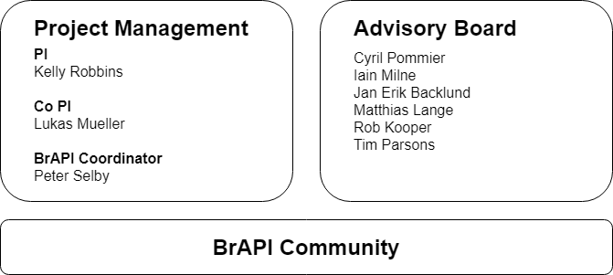
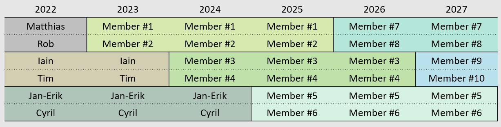

Governance
==========

Guiding Principles
------------------

- Always create something that is useful, usable, and used
- Know your use case. Solves real technical problems, not theoretical ones
- Maintain the lowest possible barrier to entry. Make it easy for new members to join the community
- There is no reason to reinvent the wheel or create competition. Use existing standards and best practices when possible

BrAPI Governance Org Chart
--------------------------

The BrAPI Advisory Board
------------------------

The Advisory Board is a group of six elected community representatives. This group is responsible for providing advice and guidance to support the Project Management group. They are also responsible for representing the community in making long term project decisions. 

The current Advisory Board includes:

- Jan-Erik Backlund
- Cyril Pommier 
- Iain Milne
- Tim Parsons 
- Shawn Yarnes, PhD
- Dr Sebastian Beier

Visit `brapi.org <https://brapi.org/projectLeadership>`__ for more information.

The Project Management Team
---------------------------

The Project Management group is responsible for the day-to-day management of the BrAPI project. These day-to-day activities include: managing project finances, maintaining the project infrastructure and documentation, organizing community events, and meeting potential new members to the community.

The current Project Management Team includes PI Kelly Robbins, Co-PI Lukas Mueller, and Project Coordinator Peter Selby.

Visit `brapi.org <https://brapi.org/projectLeadership>`__ for more information.

Elections
---------

Advisory Board members will serve in 3-year terms. These terms will be staggered so that only two members will be replaced each year. This should provide some stability within the board as a majority of the members would be maintained from year to year. Each year, there will be a general call for nominations from the community to find new members. If there are only two nominees, then they will be accepted immediately. If there are more nominees than positions available, a general community election will be held to choose the best candidates. The existing board members will have the right to veto any nominee selection if there are concerns about a conflict of interest or if the nominee seems unwilling to act in the best interest of the community. 

Each year, there will be a general call for nominations. Anyone in the BrAPI community may nominate themselves or someone else to become a representative on the Advisory Board. Previous board members may also be nominated, but they cannot serve two consecutive terms. The BrAPI Project Coordinator and any PI's involved with the funding of the project may not be nominated.

Each nominee will be required to complete a short, guided report to outline the skills and experience they possess that makes them a good candidate. This report will be used to ensure a good mix of the diverse BrAPI community is represented on the board. If a vote becomes necessary, the reports will also be used to convey information about each candidate to the voters. This Advisory Board Candidate Report will ask nominees about their skill level and relevant experience with the following topics:

- General breeding workflow
- Phenotyping and phenomics
- Genotyping and genomics
- Germplasm and accession management
- New and emerging breeding technologies
- Computer programming
- Data management

To nominate yourself, please complete a copy of the Advisory Board Candidate Report and send it to the BrAPI Project Coordinator. To nominate someone else, please send their name and contact details to the BrAPI Project Coordinator. The Coordinator will reach out to the nominee and collect more information as needed. 

